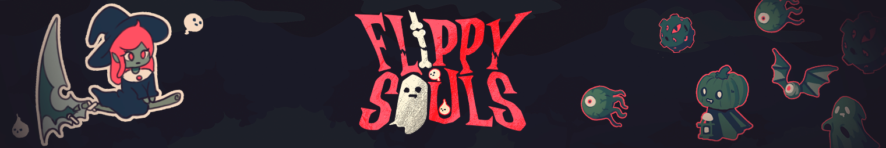

# Flippy Souls

**Flippy Souls** é um jogo estilo endless runner onde você controla uma bruxa que voa sob uma foice em uma dimensão infinita. O objetivo é eliminar inimigos para coletar suas almas e alcançar a maior distância possível.

## Índice

- [Visão Geral](#visão-geral)
- [Capturas de Tela](#capturas-de-tela)
- [Como Jogar](#como-jogar)
- [Acesso ao Jogo](#acesso-jogo)

## Visão Geral

Em **Flippy Souls**, você assume o papel de uma bruxa em uma jornada infinita, voando por uma dimensão misteriosa e enfrentando inimigos ao longo do caminho. A cada inimigo derrotado, você coleta suas almas para alcançar uma pontuação mais alta. 

### Objetivo do Jogo
Mate os inimigos para adquirir XP e habilidades, colete suas almas para adiquirir vida e ter mais tempo de jogo. Cada habilidade possui 3 leveis, monte a melhor build  e não esqueça de utilizar o especial para atingir os melhores recordes.

## Capturas de Tela

| Voo da bruxa na foice                           | Ataque Especial                         |
|-------------------------------------------------|------------------------------------------------|
|         |                  |

| Habilidades                                | Pontuação Máxima                               |
|-------------------------------------------------|------------------------------------------------|
|  |             |

## Como Jogar

- **Espaço / Clique**: Pula e Ataca;

- **R**: Especial;

- **ESC**: Pausa o jogo;

# Acesso ao Jogo

Acesse o [itch.io para jogar](https://deliryun.itch.io/flippy-souls) e deixe seu feedback nos comentários.
